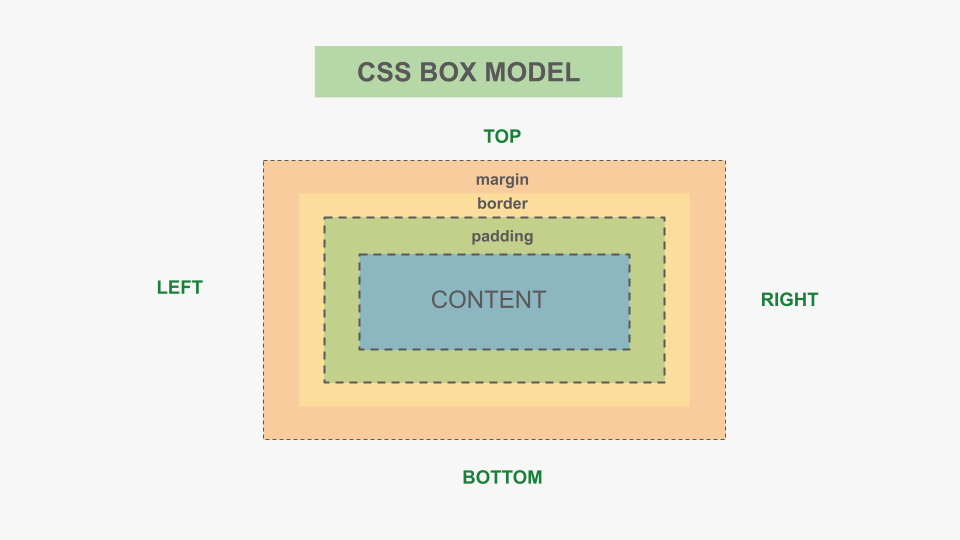
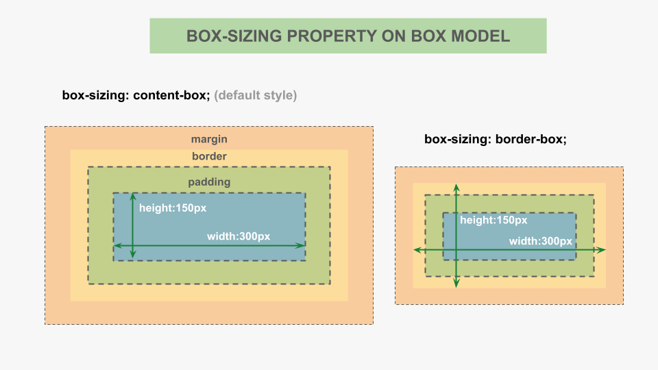
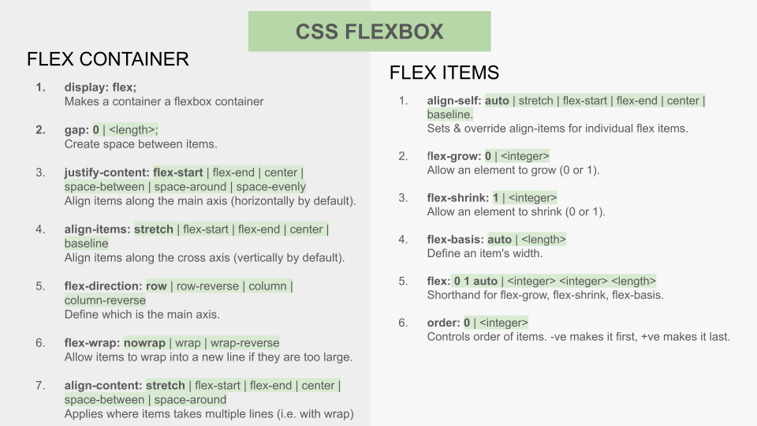
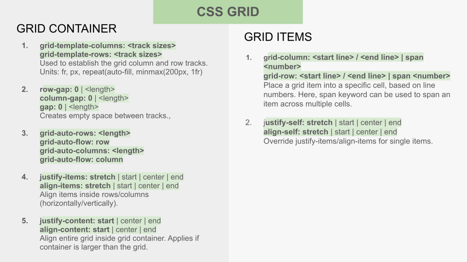
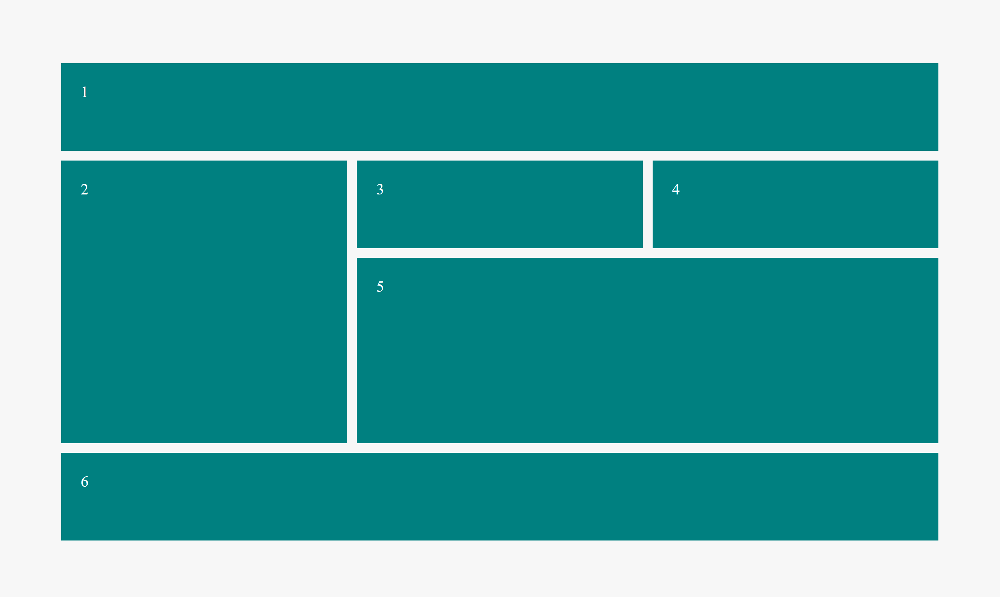

# CSS Course Notes

## 1️. Introduction to CSS

- **What is CSS?** – CSS (Cascading Style Sheets) is used to style HTML elements by controlling layout, colors, fonts, spacing, and more.
- **Why CSS?** – CSS enhances website presentation, and enables responsive design.
- **Types of CSS:**
  - Inline CSS (Directly inside an element using `style=""`)
  - Internal CSS (Within `<style>` in `<head>`)
  - External CSS (Linked via a `.css` file) – Best practice!
- **CSS Syntax** – Understanding selectors, properties, and values.

```css
h1 {
  font-family: sans-serif;
  font-size: 20px;
  color: #33333;
  line-height: 1.5;
}
```

## 2️. Selectors in CSS

- **What are Selectors?** – Selectors define which HTML elements will be styled.
- **Types of Selectors:**
  - Universal Selector (`*`) – Selects all elements.
  - Element Selector (`h1`, `p`, `div`) – Targets specific HTML tags.
  - Class Selector (`.class-name`) – Targets elements with a specific class.
  - ID Selector (`#id-name`) – Targets a unique element by ID.
  - Group Selector (`h1, p, div`) – Styles multiple elements together.
  - Attribute Selector (`input[type="text"]`) – Targets elements with specific attributes.
  - Pseudo-classes (`:hover`, `:focus`) – Styles elements based on user interaction.
  - Pseudo-elements (`::before`, `::after`) – Inserts content before/after an element.

## 3. The Cascading Nature of CSS

The cascading nature of CSS refers to how CSS resolves conflicts when multiple styles are applied to the same element. These rules determine which style takes precedence when there are conflicts.

### Key Factors in the Cascade

#### 1. Importance (Inline Styles and `!important`)

- Inline styles (styles written directly in an element's `style` attribute) have the highest specificity.
- The `!important` declaration overrides all other declarations (except other `!important` styles with higher specificity).

#### 2. Specificity

CSS rules are ranked by how specifically they target elements.

**Specificity hierarchy:**

1. **Inline styles** (`style="..."`) – highest specificity.
2. **IDs** (`#id`).
3. **Classes, attributes, and pseudo-classes** (`.class`, `[attribute]`, `:hover`).
4. **Elements and pseudo-elements** (`div`, `p`, `::before`).

**Example of specificity calculation:**

```html
<p class="highlight" id="main">I am a test paragraph</p>
```

```css
/* Specificity: 0, 0, 1 */
p {
  color: blue;
}

/* Specificity: 0, 1, 0*/
.highlight {
  color: green;
}

/* Specificity: 1, 0, 0 */
#main {
  color: red;
}
```

In this case, `#main` would override the others.

#### 3. Source Order (Last Rule Wins)

When two or more rules have the same specificity and importance, the one that appears later in the CSS file or in the document wins.

**Example:**

```html
<style>
  p {
    color: blue;
  }
  p {
    color: green;
  } /* This takes precedence */
</style>
```

#### 4. Inheritance

- Some properties (like `color`, `font-family`) are inherited by default.
- Non-inherited properties (like `margin`, `padding`) need to be explicitly defined or inherited using the `inherit` value.

**Example:**

```css
body {
  color: black;
}
p {
  font-family: Arial;
}
```

The `<p>` tag inherits `color: black` but uses `font-family: Arial`.

#### 5. Default Browser Styles

Browsers apply their default styles (called **user agent styles**) if no CSS is provided.

**Example:**  
`<h1>` is bold by default due to browser styles.

## 4. Box Model in CSS

- **What is the Box Model?** – Every HTML element is a box with four sides: `top`, `right`, `bottom`, `left`:

  - **Content** – The actual text or image inside an element.
  - **Padding** – Space around the content.
  - **Border** – The outer edge surrounding the padding.
  - **Margin** – Space between elements.

    

- **Use** `box-sizing: border-box; ` to include padding & border in total width/height.



## 5. CSS Colors & Backgrounds

- **Applying Colors:**
  - Named colors (`teal`, `red`, `blue`, `green`) -> [140 supported color names](https://www.w3schools.com/colors/colors_names.asp)
  - RGB (`rgb(255, 87, 51)`) -> [RGB play ground](https://www.w3schools.com/colors/colors_rgb.asp)
  - HEX codes (`#ff5733`) -> [Hex color play ground](https://www.w3schools.com/colors/colors_hexadecimal.asp)
  - HSL (`hsl(9, 100%, 60%)`) -> [HSL color play ground 1](https://www.w3schools.com/colors/colors_hsl.asp) | [HSL color play ground 2](https://www.figma.com/color-wheel/)
- **Background Properties:**
  - `background-color` (Sets background color)
  - `background-image` (Sets background image)
  - `background-size` (Controls image size – `cover`, `contain`)
  - `background-repeat` (Repeats image or not – `no-repeat`)

## 6. CSS Typography (Fonts & Text Styling)

- **Font Properties:**
  - `font-family` – Sets typeface (e.g., `Arial`, `Serif`)
  - `font-size` – Controls text size (`px`, `em`, `rem`, `%`)
  - `font-weight` – Boldness (`normal`, `bold`, `bolder`, `lighter`)
  - `font-style` – Italic, oblique
- **Text Styling:**
  - `text-align` – Aligns text (`left`, `center`, `right`, `justify`)
  - `text-decoration` – Underline, line-through, overline
  - `letter-spacing`, `word-spacing` – Adjusts spacing
  - `line-height` – Adjusts vertical space between lines

## 7. CSS Positioning & Layout

- **Different Positioning Methods:**
  - `static` – Default (normal document flow)
  - `relative` – Positions relative to its normal position
  - `absolute` – Positions relative to the nearest positioned ancestor
  - `fixed` – Stays fixed relative to the viewport
  - `sticky` – Sticks to a position while scrolling
- **`Z-index`** – Controls overlapping of elements.

## 8. CSS Flexbox (For Responsive Layouts)

- **What is Flexbox?** – A one-dimensional layout system for creating responsive designs.



## 9. CSS Grid (For Advanced Layouts)

- **What is CSS Grid?** – A two-dimensional layout system for designing complex layouts.





## 10. CSS Transitions & Animations

- **What are Transitions?** – Smoothly animates changes in CSS properties.
  - Example: `transition: all 0.3s ease-in-out;`
- **What are Animations?** – More complex animations with `@keyframes`.

  - Example:

    ```css
    .class-name {
      animation: slideIn 0.4s ease;
    }

    @keyframes slideIn {
      from {
        opacity: 0;
      }
      to {
        opacity: 1;
      }
    }
    ```

## 11. Responsive Web Design (Media Queries)

- **Why Responsive Design?** – Ensures websites work on all screen sizes.
- **Using Media Queries:**
  ```css
  @media (max-width: 768px) {
    body {
      background-color: lightblue;
    }
  }
  ```
- **Best Practices:**
  - Use relative units (`%`, `em`, `rem`, `vh`, `vw`) instead of `px`.
  - Use Flexbox & Grid for fluid layouts.

# CSS Variables & Best Practices

- **What are CSS Variables?** – Custom properties that make styles reusable.
  ```css
  :root {
    --primary-color: #ff5733;
  }
  ```
- **Best Practices:**
  - Use external stylesheets (`.css` files).
  - Keep code organized and modular.
  - Follow **DRY Principle** (Don’t Repeat Yourself).

---
